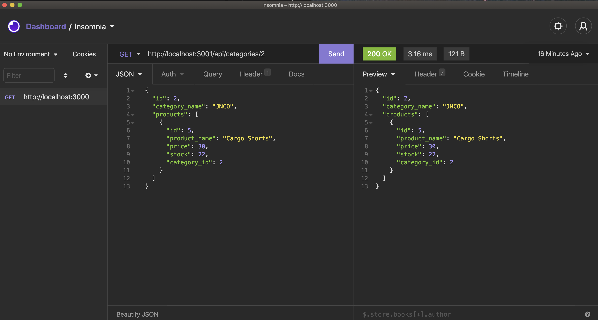

# E-commerce_Inventory

## Project Title

E-commerce_Inventory

## Link to project repository:

[Github-Repo](https://github.com/Bkrendan12/E-commerce_Inventory)

## Link to Project Video Walk-through

[Link-Application-video-walkthrough](https://www.youtube.com/watch?v=GPsV2MQvBpc)
[Link-Application-video-walkthrough](https://youtu.be/GPsV2MQvBpc)

## Screenshots for Application





## Tech Used

javascript, node.js, Express npm package

## Motivation

I needed a way to keep track of all my products in my store inventory, so this application was built to do just that.

## GIVEN a note-taking application

```
WHEN I open the Music Genre Blog page
THEN I am presented with a homepage with already created posts from other users

WHEN I click on the link to signup / login
THEN I am presented with a login / singup page giving the user the option to either create a new profile or login if the user is already signed up

WHEN I am in my profile
THEN I am able to add and delete blog posts to the main blog homepage

WHEN I click on othe user's blog posts
THEN I am able to add or delete comments to the user's post

WHEN I click logout
THEN I am automattically logged out and brought back to the homepage where I can only VIEW other people's posts, but I can't add or delete a post or comments on other user's posts

```

## Contact Information

- Brendan Kurylo
- 603-818-0578
- bkrendan12@gmail.com
- Rollinsford, NH

## Credits include:

All work created by Brendan Kurylo.

UNH Bootcamp © Brendan Kurylo
